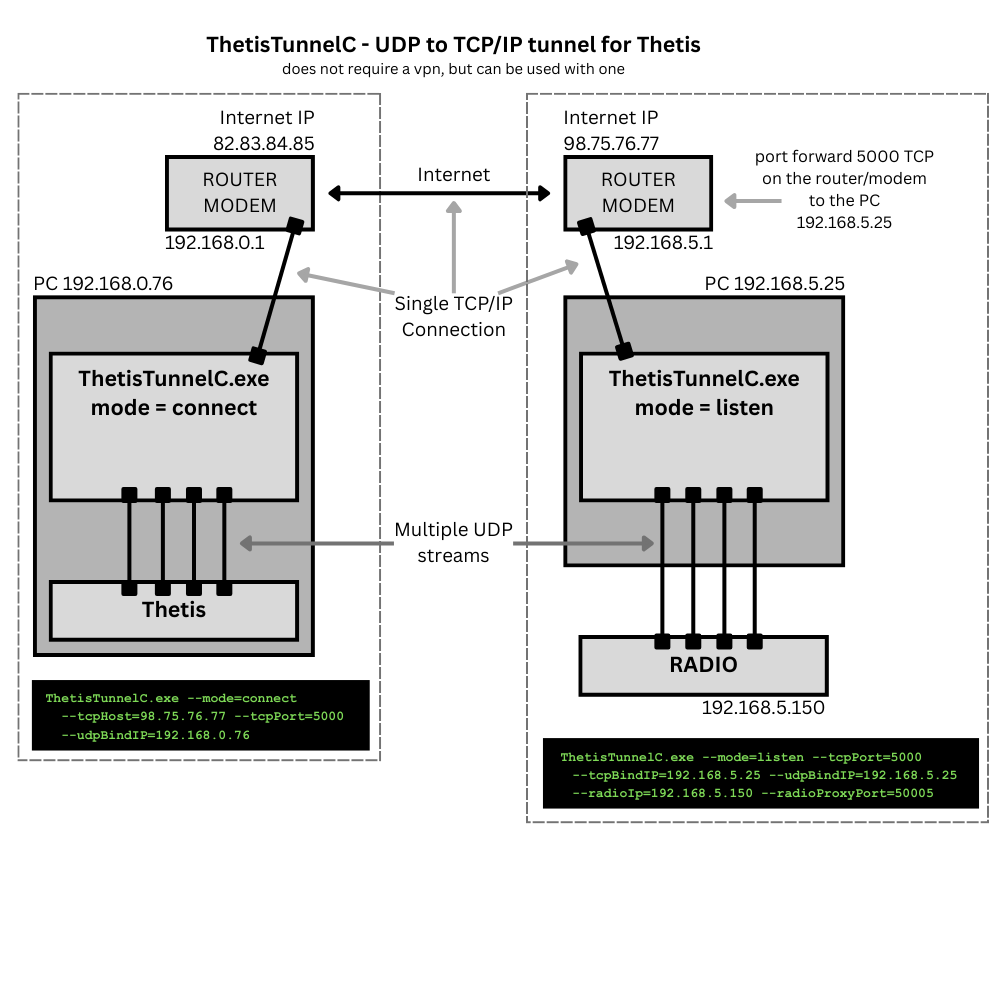

# ThetisTunnel
A C++ tool that tunnels the UDP data in/out of Thetis and a Radio



# Help

```ThetisTunnelC.exe --help```

At the remote (listen) site, you will need to portforward a TCPip port on the router/modem to the machine that
runs this tool. The port is defined by the --tcpPort option.

# Options

```A TCP tunnel for Thetis UDP traffic.
Run one instance at the radio site (listen) and one at the Thetis site (connect).

Usage:
  ThetisTunnelC.exe --mode=listen  --tcpPort=PORT --tcpBindIP=IP --udpBindIP=IP --radioIp=IP --radioProxyPort=PORT [options]
  ThetisTunnelC.exe --mode=connect --tcpHost=IP  --tcpPort=PORT --udpBindIP=IP [--thetisPorts=RANGE] [options]

Required arguments:
  --mode=listen|connect
      listen  : radio-site end (accepts one TCP client and forwards UDP in/out of the tunnel to/from the radio)
      connect : Thetis-site end (connects to the listener and forwards local UDP in/out of the tunnel)
  --tcpPort=PORT
      TCP port for the tunnel

Listen mode (radio site) arguments:
  --tcpBindIP=IP
      Local IP to bind the TCP listener to (use 0.0.0.0 for all interfaces)
  --udpBindIP=IP
      Local IP to bind UDP sockets to (pick the interface that reaches the radio)
  --radioIp=IP
      Radio IPv4 address
  --radioProxyPort=PORT
      Local UDP port used to send to the radio and receive replies
  --radioSrcRange=LO-HI
      Radio source UDP port range accepted back from the radio (default 1024-1042)
      Format: 1024-1042 or 1024,1025,1030-1042 (default 1024-1042)

  --broadcast1024
      If enabled, port 1024 discovery frames that match the expected signatures are also broadcast to:
        - the directed broadcast address of the radio subnet (if it can be determined)
        - 255.255.255.255

Connect mode (Thetis site) arguments:
  --tcpHost=IP
      Listener public IP (or reachable private IP) or radio.mydomain.com
  --udpBindIP=IP
      Local IP to bind UDP sockets to (interface used by Thetis)
  --thetisPorts=RANGE
      UDP destination ports to listen for from Thetis.
      Format: 1024-1029 or 1024,1025,1030-1032 (default 1024-1029)

Options:
  --key=VALUE
      If provided on the lisener (Radio site), then the connect (Thetis site) must match; up to a 32 char string
  --noUI
      Disable the live data throughput display
  --maxInRate=VALUE
      Show IN rate bars scaled to VALUE (bits per second). Supports suffix K/M/G, e.g. 2214, 10M, 1G
  --maxOutRate=VALUE
      Show OUT rate bars scaled to VALUE (bits per second). Supports suffix K/M/G, e.g. 2214, 10M, 1G

Examples:

  Radio site (listen): bind to 192.168.0.76 port 5000, talk to radio 192.168.0.157 via local UDP port 50005, secure key abc123
  ThetisTunnelC.exe --mode=listen --tcpPort=5000 --tcpBindIP=192.168.0.76 --udpBindIP=192.168.0.76 --radioIp=192.168.0.157 --radioProxyPort=50005 --key=abc123

  Thetis site (connect): connect to listener 82.83.84.85:5000 and bind local UDP to 192.168.0.76, secure key abc123
  ThetisTunnelC.exe --mode=connect --tcpHost=82.83.84.85 --tcpPort=5000 --udpBindIP=192.168.0.76 --key=abc123

Quit:
  Press Q to quit, or use Ctrl+C.```
  
